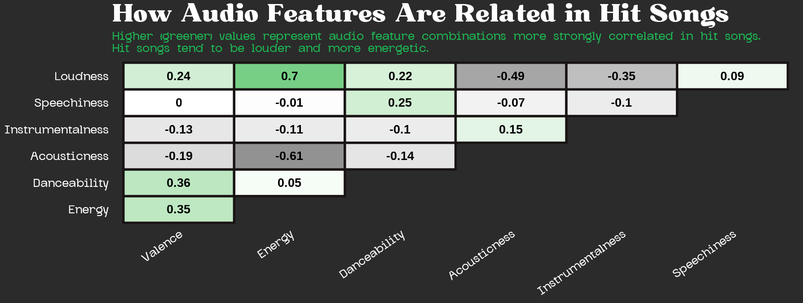
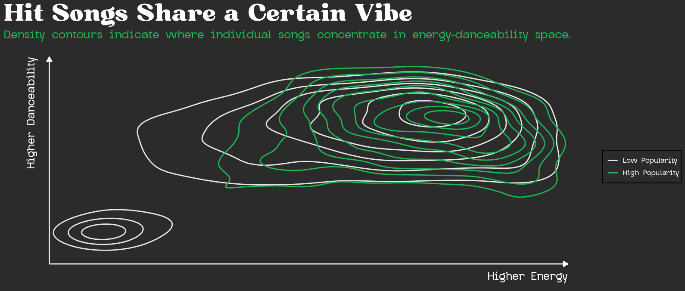
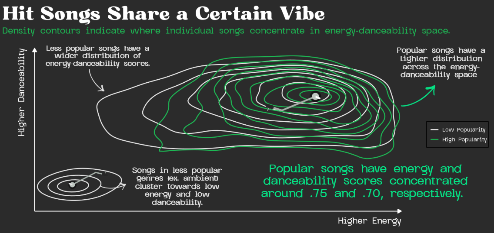
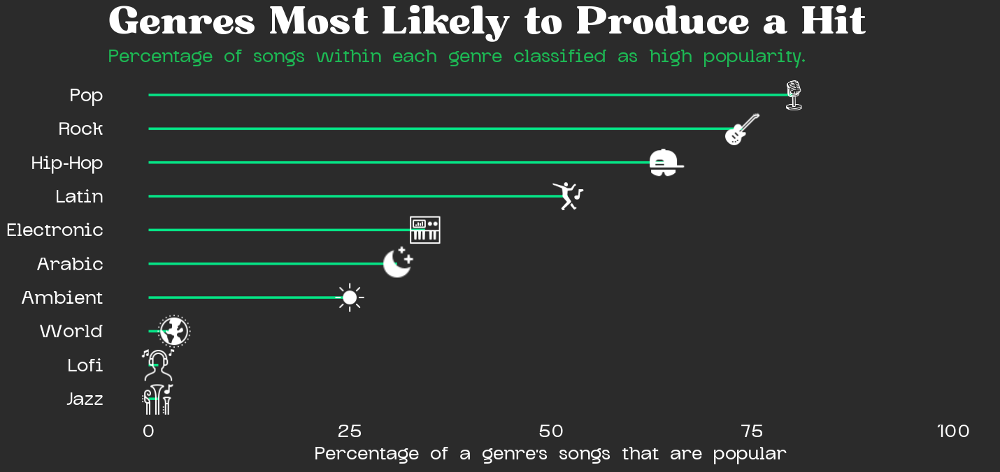
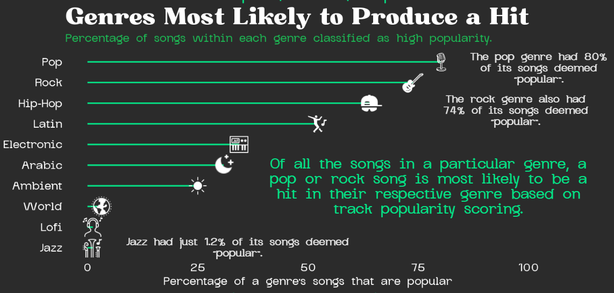

# The Anatomy of a Spotify Hit


Music is an essential part of daily life as it shapes moods, makes memories, and defines cultural moments. As someone who loves karaoke and vocal technique, I have always been personally curious about what makes certain songs resonate so deeply with listeners. With the rise of algorithmic music discovery, the question of what makes a song popular has become a topic of interest. Spotify, the world's largest audio streaming platform with over 751 million users and a catalog spanning 100,000 tracks, 7 million podcasts, and 500,000 audiobooks, sits at the center of this shift ([Spotify Newsroom, n.d.](https://newsroom.spotify.com/company-info/)). Its dominance in the streaming landscape and its influence on charts, like the Billboard Hot 100, makes it a compelling lens through which to visualize modern music popularity.

This project aims to uncover and explore the audio and genre characteristics that distinguish Spotify hits from the rest of the catalog. Drawing on the [Spotify Music Dataset](https://www.kaggle.com/datasets/solomonameh/spotify-music-dataset) compiled by Solomon Ameh and accessed via Kaggle, I visualize the sonic "ingredients" behind a Spotify hit using Spotify’s audio feature data including attributes like energy, danceability, loudness, and acousticness, alongside a popularity score based on total streams and recency of plays. "Hits" were defined based on a score of 68 (roughly the 75th percentile across the dataset) to separate high-performance tracks from the rest.

This infographic explores three core questions:

-   How do audio features relate to one another in popular songs?

-   Do hit songs cluster around certain energy–danceability combinations?

-   Which genres are most likely to produce a popular track?

Together, these visualizations aim to reveal whether there is a discernible recipe behind a Spotify hit.

## Final Infographic

The finalized infographic is compiled of three plots built using `ggplot` and further designed in Canva.


## Spotify Web API Dataset

The dataset is split into two files: a low-popularity subset (scores of 11-68) and a high-popularity subset (scores of 68-100). After merging, cleaning, and removing duplicates, I retained a dataset of several thousand tracks. Because the low-popularity group was considerably larger, I drew a random sample of low-popularity songs equal in size to the high-popularity group (n = 1,686) to create a balanced dataset. This ensured that any detected patterns reflect genuine differences between the popularity groups, rather than an finding from unequal sample sizes.

The audio features I focused on were:

-   **Valence:** How happy or sad a track sounds.

-   **Energy:** Intensity and activity level of a track.

-   **Danceability:** How suitable a track is for dancing based on tempo, rhythm stability, beat strength, and overall regularity.

-   **Acousticness**: Likelihood that a track is acoustic (0-1).

-   **Instrumentalness:** Degree to which a track lacks vocals.

-   **Speechiness:** Presence of spoken words in the track.

-   **Loudness:** Overall volume in decibels (dB).

For further information on variable definitions and measurement, please see the [Spotify Web API documentation](https://developer.spotify.com/documentation/web-api/reference/get-audio-features).

## Graphical Forms

All three plots were built in `ggplot2` and finished in Canva, where I added annotations and decorative elements. All code is include the folded chunk at the bottom of this page.

### Correlation heatmap: how audio features relate in hits

I chose a correlation heatmap to explore how audio features interact with one another in popular songs. A correlation matrix is one of the most efficient ways to show all pairwise relationships at once. I filtered to high-popularity songs only since my goal was specifically to understand the internal structure of hits.

The strong positive correlation between energy and loudness (r = 0.70) indicates that louder songs tend to feel more energetic; this aligns with what people hear intuitvely in popular music. Acousticness, however, shows a strong negative correlation with energy (r = -0.61). Instrumentalness and speechiness notably stand apart from other measures, suggesting that they may operate more independently in hit songs. Interestingly, speechiness and valence show almost no correlation.

Here is the plot generated from `ggplot`:



### Contour plot: do hit songs share a "vibe"?

I chose a 2D density contour plot to examine how songs are distributed across energy and danceability, as well as how densely they cluster within this space. With nearly 3,000 songs, a traditional scatter plot would suffer from heavy overplotting and obscure meaningful patterns between popularity groups. The contour plot instead highlights regions of varying concentration, making patterns easier to interpret. It outlines that high-popularity songs (green) cluster tightly in the upper-right region, while low-popularity songs (white) are more diffusely spread across the chart.

The most striking finding is how concentrated the popular song contours are: hits cluster around an energy score of \~0.75 and a danceability score of \~0.70. There is also a small isolated cluster of low-popularity songs in the lower-left, corresponding to less popular genres like wellbeing and ambient that tend to be quieter and less danceable.

To keep the visualization clean and intuitive, I removed point indices so readers can focus on the overall pattern and distribution in the 2D energy-danceability space. Additionally, I incorporated the x-axis and y-axis as segments to indicate directionality for increasing energy and danceability. Here is the base plot out of `ggplot`:



Another reason I opted for a 2D contour plot is the similarity in appearance to a vinyl on a record player! As a vinyl collector myself, I was interested in visualizing this clustering as if each popularity group is spinning on a record player through this 2D space. Arrows and callout text pointing these patterns out were added separately in Canva, as well as a tonearm to simulate each contour as a ridge on a vinyl:



### Lollipop chart: which genres produce the most hits?

Rather than comparing raw counts of popular songs by genre, I calculated the percentage of songs within each genre that exceed the popularity threshold. This framing is more informative as a genre with 50 songs and 40 hits is a stronger "hit maker factory" than one with 1,000 songs and 200 hits; raw counts would obsecure this likelihood of popularity. To visualize this, I utilized a lollipop chart as it clearly communicates ranked proportions without the visual weight of a bar chart. The minimal design also leaves space for incorporating genre icons, added using `geom_image`:



I also decided to exlude "gaming" as a playlist genre because it represents a Spotify playlist type rather than a specific genre; its tracks largely overlap with pop, hip-hop, and R&B, which are already captured elsewhere in their respective genres.

The results indicate notable contrasts across genres. Pop has about 80% of its songs classified as hits, followed by rock at about 74%. World, lofi, and jazz have the least percentage of hit songs in their respective genres. Genre is likely a strong factor in determining a song's success, as pop or rock songs have a substantially higher baseline probability of becoming hits compared to those in lofi or ambient categories.

Annotations and callouts were added in Canva to highlight standout genres in the lollipop chart:



## Design Decisions

I focused on ensuring the infographic felt intentional and cohesive rather than disconnected to better shape the structure of a Spotify song’s anatomy. Through clear visual hierarchy, consistent styling, and thoughtful layout, I aimed to guide a viewer’s attention in a structured way and create a unified narrative around the nature of Spotify’s most popular songs.

### **Graphic form**

Each plot type was chosen for its communicatation purposed and not simply for convention. The heatmap, for example, makes all audio feature pairwise correlations immediately scannable. Additionally, the contour plot reveals distributional density in a simplified manner compared to a scatterplot with 3,000 overlapping points. The lollipop chart meaningfully conveys ranked proportions with less visual weight than a bar chart. As such, selecting the appropriate chart type was the first step in making each panel clear and easy to interpret.

### **Color palette**

The infographic is supported by Spotify’s signature green (`#1DB954`) on a near-black background (`#2b2b2b`) to better signal the subject matter without explicitly labeling that the infographic relates to Spotify data. Green and white were chosen for annotations to create a two-color language that highlight key findings across each plot. For example, green was utilized to highlight the primary takeaway from each plot, while white was chosen for general annotations.

### **Themes**

I aimed to incorporate non-data visual elements to create engaging associations that highlight key takeaways. For example, I used icons to represent each genre in my lollipop chart, making the visualization more intuitive (ex. a microphone for pop music or a keyboard for electronic music).

### **Typography and text**

I used two custom fonts throughout: Bugaki for titles which has a slightly retro vibe, and Glock Grotesk for all body text and labels to keep things readable without clashing with the titles. Keeping one expressive and one functional font family creates typographic consistency across all three panels and the Canva layout. As such, the infographic reads as a single object rather than three separate charts pasted together.

### **Visual hierarchy and layout**

The three plots are intentionally ordered to build a clear argument: first, how audio features relate (heatmap establishes landscape); second, whether a “signature sound” exists (contour plot reveals clustering); and third, which genres are most likely to land there (lollipop chart provides genre-level context).

Within each panel, I included bold green subtitles to highlight the key takeaway such that skimming each plot provides the main insight immediately. Decorative elements, such as waveform dividers and music-themed icons in Canva, add visual consistency and sectioning without cluttering information.

## Key Findings

Is there a discernible recipe for a Spotify hit? Based on this exploration, there may be one, but only to some degree. Popular songs tend to be loud, energetic, and danceable. Genre also seems to be a strong factor in influencing a song's popularity likelihood. Pop and rock songs have a higher likelihood of achieving popularity, whereas "calmer" genres (ex. lofi and jazz) face more of a challenge to reach popularity. The contour plot clearly outlined that high-popularity songs form a notably tight cluster, indicating that hits not only share a few traits but also occupy a very specific region of this sonic space.

It is worth noting that the data cannot explain why this pattern exists. For example, is a pop song more popular because it resonates more with listeners or because Spotify's algorithm historically amplifies these tracks, potentially introducing bias? Additional behavioral data, for example, is probably required to address this question and is a topic of interest for further analysis.

## All Code

All code is included below for reference.

```{r}
#| echo: true
#| eval: false
# ── Load packages ─────────────────────
library(tidyverse)
library(ggthemes)
library(showtext)
library(ggimage)

# ── Font import ─────────────────────
font_add("Bugaki", "~/MEDS/eds-240/eds240-infographic/fonts/Bugaki.ttf")
font_add("Glock Grotesk", "~/MEDS/eds-240/eds240-infographic/fonts/GlockGrotesque-Medium.ttf")
showtext_auto()

# ── Data import ─────────────────────
high_popular <- read.csv("data/high_popularity_spotify_data.csv")
low_popular  <- read.csv("data/low_popularity_spotify_data.csv")
spotify_clean <- bind_rows(low_popular, high_popular)

# ── Wrangle ─────────────────────
spotify_clean <- spotify_clean %>%
  select(track_id, track_name,
         playlist_genre, acousticness,
         track_popularity,
         valence, energy, danceability, mode, loudness, tempo, speechiness, instrumentalness, liveness) %>%
  distinct() %>%
  drop_na() %>%
  mutate(popularity_group = factor(
    ifelse(track_popularity > 68, "high", "low"),
    levels = c("low", "high")
  ))

# Popularity threshold histogram for track popularity cutoff justification
spotify_clean %>%
  mutate(popularity_group = factor(
    ifelse(track_popularity > 68, "high", "low"),
    levels = c("low", "high")
  )) %>%
  ggplot(aes(x = track_popularity, fill = popularity_group)) +
  geom_histogram(binwidth = 2, color = "white", linewidth = 0.1) +
  geom_vline(xintercept = 68, color = "white", linewidth = 1, linetype = "dashed") +
  scale_fill_manual(values = c("low" = "#535353", "high" = "#1DB954"),
                    labels = c("Low Popularity", "High Popularity")) +
  labs(title = "Distribution of Track Popularity Scores",
       subtitle = "A score of 68 (~75th percentile) separates high and low popularity songs.",
       x = "Track Popularity", y = "Count", fill = NULL) +
  theme_minimal()

# Balance dataset
set.seed(123) # For reproducibility
n <- nrow(high_popular)
low_sample <- low_popular %>% slice_sample(n = n)

spotify_clean <- bind_rows(
  high_popular %>% mutate(popularity_group = "high"),
  low_sample   %>% mutate(popularity_group = "low")
) %>%
  select(track_id, track_name,
         playlist_genre, acousticness,
         track_popularity,
         valence, energy, danceability, mode, loudness, tempo, speechiness, instrumentalness, liveness) %>%
  distinct() %>%
  drop_na() %>%
  mutate(popularity_group = factor(
    ifelse(track_popularity > 68, "high", "low"),
    levels = c("low", "high")
  ))

# Ensure balance is set
table(spotify_clean$popularity_group)

# ── Plot 1: Correlation heatmap ─────────────────────
music_labels <- c(
  valence = "Valence",
  energy = "Energy",
  danceability = "Danceability",
  acousticness = "Acousticness",
  instrumentalness = "Instrumentalness",
  speechiness = "Speechiness",
  loudness = "Loudness"
)

var_order <- c("valence", "energy", "danceability",
               "acousticness", "instrumentalness",
               "speechiness", "loudness")

spotify_clean %>%
  filter(popularity_group == "high") %>%
  select(all_of(var_order)) %>%
  cor() %>%
  round(2) %>%
  as.data.frame() %>%
  rownames_to_column("var1") %>%
  pivot_longer(-var1, names_to = "var2", values_to = "corr") %>%
  mutate(
    var1 = factor(var1, levels = var_order),
    var2 = factor(var2, levels = var_order)
  ) %>%
  filter(as.numeric(var1) > as.numeric(var2)) %>%
  ggplot(aes(x = var2, y = var1, fill = corr)) +
  geom_tile(color = "#191414", linewidth = 1.5) +
  geom_text(aes(label = corr), size = 7, color = "black", fontface = "bold") +
  scale_fill_gradient2(
    low = "#535353", mid = "white", high = "#1DB954",
    midpoint = 0, limits = c(-1, 1),
    guide = "none"
  ) +
  scale_x_discrete(labels = music_labels) +
  scale_y_discrete(labels = music_labels) +
  labs(
    title = "How Audio Features Are Related in Hit Songs",
    subtitle = "Higher (greener) values represent audio feature combinations more strongly correlated in hit songs.\nHit songs tend to be louder and more energetic.",
    x = NULL, y = NULL, fill = NULL
  ) +
  theme_minimal() +
  theme(
    plot.background  = element_rect(fill = "#2b2b2b", color = NA),
    panel.background = element_rect(fill = "#2b2b2b", color = NA),
    plot.title       = element_text(size = 40, color = "white", face = "bold", family = "Bugaki"),
    plot.subtitle    = element_text(color = "#1DB954", size = 15, face = "bold", family = "Glock Grotesk"),
    axis.text.x      = element_text(angle = 35, hjust = 1,
                                    color = "white", size = 15, face = "bold", family = "Glock Grotesk"),
    axis.text.y      = element_text(color = "white", size =15, face = "bold", family = "Glock Grotesk"),
    panel.grid       = element_blank(), 
  )

# ── Plot 2: Contour plot ─────────────────────
energy_dance_df <- spotify_clean %>%
  select(energy, danceability, popularity_group)

energy_dance_df %>%
  ggplot(aes(x = energy, y = danceability, color = popularity_group)) +
  geom_density_2d(linewidth = 0.8, bins = 10) +
  scale_color_manual(
    values = c("low" = "#e6e6e6", "high" = "#1DB954"),
    labels = c("low" = "Low Popularity", "high" = "High Popularity")
  ) +
  labs(
    title = "Hit Songs Share a Certain Vibe",
    subtitle = "Density contours indicate where individual songs concentrate in energy-danceability space.",
    x = NULL, y = NULL, color = NULL
  ) +
  coord_cartesian(clip = "off") +

  # Adjust x-axis arrow along bottom
annotate("segment", x = -.1, xend = 1.02, y = 0, yend = 0,
         arrow = arrow(length = unit(0.25, "cm"), type = "closed"),
         color = "white", linewidth = 0.7) +
annotate("text", x = 1.02, y = -0.06, label = "Higher Energy",
         color = "white", family = "Glock Grotesk", fontface = "bold",
         size = 5, hjust = 1) +
  # Adjust y-axis arrow along left
annotate("segment", x = -0.1, xend = -0.1, y = 0, yend = 1.02,
         arrow = arrow(length = unit(0.25, "cm"), type = "closed"),
         color = "white", linewidth = 0.7) +
annotate("text", x = -0.14, y = 1.02, label = "Higher Danceability",
         color = "white", family = "Glock Grotesk", fontface = "bold",
         size = 5, hjust = 1, angle = 90) +
  
  theme_minimal() +
  theme(
    plot.background    = element_rect(fill = "#2b2b2b", color = NA),
    panel.background   = element_rect(fill = "#2b2b2b", color = NA),
    plot.title         = element_text(size = 40, color = "white", face = "bold", family = "Bugaki"),
    plot.subtitle      = element_text(size = 15, color = "#1DB954", face = "bold", family = "Glock Grotesk"),
    axis.text.x = element_blank(),
    axis.text.y = element_blank(),
    legend.background  = element_rect(fill = "#2b2b2b"),
    legend.text        = element_text(color = "white", face = "bold", family = "Glock Grotesk"),
    legend.title       = element_text(color = "white", family = "Glock Grotesk"),
    panel.grid         = element_blank()
  )

# ── Plot 3: Lollipop chart ─────────────────────
# Calculate proportion of popular songs
genre_pct <- spotify_clean %>% 
  count(playlist_genre, popularity_group) %>%
  group_by(playlist_genre) %>%
  mutate(pct = n / sum(n) * 100) %>%
  ungroup() %>%
  filter(popularity_group == "high")

# Extract top 10 genres with the highest proportion of popular songs
top_genres <- top_genres <- spotify_clean %>%
  count(playlist_genre) %>%
  filter(playlist_genre != "gaming") %>%
  slice_max(n, n = 10) %>%
  pull(playlist_genre)

genre_pct <- genre_pct %>%
  filter(playlist_genre %in% top_genres)

# Add icons as a column
genre_pct <- genre_pct %>%
  mutate(icon_path = case_when(
    playlist_genre == "pop"        ~ "~/MEDS/eds-240/eds240-infographic/icons/icons8-microphone-100.png",
    playlist_genre == "rock"       ~ "~/MEDS/eds-240/eds240-infographic/icons/icons8-electric-guitar-50.png",
    playlist_genre == "hip-hop"    ~ "~/MEDS/eds-240/eds240-infographic/icons/icons8-rap-48.png",
    playlist_genre == "latin"      ~ "~/MEDS/eds-240/eds240-infographic/icons/icons8-dancing-64.png",
    playlist_genre == "electronic" ~ "~/MEDS/eds-240/eds240-infographic/icons/icons8-electronic-music-50.png",
    playlist_genre == "arabic"     ~ "~/MEDS/eds-240/eds240-infographic/icons/icons8-moon-and-stars-30.png",
    playlist_genre == "ambient"    ~ "~/MEDS/eds-240/eds240-infographic/icons/icons8-sun-50.png",
    playlist_genre == "world"      ~ "~/MEDS/eds-240/eds240-infographic/icons/icons8-earth-50.png",
    playlist_genre == "lofi"       ~ "~/MEDS/eds-240/eds240-infographic/icons/icons8-listening-to-music-on-headphones-50.png", 
     playlist_genre == "jazz"       ~ "~/MEDS/eds-240/eds240-infographic/icons/icons8-jazz-50.png"))

genre_pct %>%
  mutate(playlist_genre = str_to_title(playlist_genre)) %>%
  ggplot(aes(x = pct, y = reorder(playlist_genre, pct))) +
  geom_segment(aes(x = 0, xend = pct, yend = playlist_genre),
               color = "#05e486", linewidth = 1) +
  geom_image(aes(image = icon_path), size = 0.06, asp = 10/6) + # Adjust icon size
  scale_x_continuous(limits = c(0, 100)) +
  labs(
    title = "Genres Most Likely to Produce a Hit",
    subtitle = "Percentage of songs within each genre classified as high popularity.",
    x = "Percentage of a genre's songs that are popular",
    y = NULL
  ) +
  theme_minimal() +
  theme(
    plot.background  = element_rect(fill = "#2b2b2b", color = NA),
    panel.background = element_rect(fill = "#2b2b2b", color = NA),
    plot.title       = element_text(size = 40, color = "white",   face = "bold", family = "Bugaki"),
    plot.subtitle    = element_text(size = 15, color = "#1DB954", face = "bold", family = "Glock Grotesk"),
    axis.title.x     = element_text(size = 15, color = "white",   face = "bold", family = "Glock Grotesk"),
    axis.title.y     = element_text(size = 15, color = "white",   face = "bold", family = "Glock Grotesk"),
    axis.text.x      = element_text(size = 15, color = "white",   face = "bold", family = "Glock Grotesk"),
    axis.text.y      = element_text(size = 15, color = "white",   face = "bold", family = "Glock Grotesk"),
    panel.grid       = element_blank()
  )
```

## Icon Attribution

Icons are derived from [icons8](https://icons8.com/).

-   `Microphone: <a target="_blank" href="https://icons8.com/icon/MlGSWD5FCHqv/microphone"`{=html}Microphone</a> icon by `<a target="_blank" href="https://icons8.com"`{=html}Icons8</a>

-   Electric Guitar: `<a target="_blank" href="https://icons8.com/icon/11076/rock-music"`{=html}electric guitar</a> icon by `<a target="_blank" href="https://icons8.com"`{=html}Icons8</a>

-   Rap: `<a target="_blank" href="https://icons8.com/icon/fzTNjNsM9oYv/rap"`{=html}Rap</a> icon by `<a target="_blank" href="https://icons8.com"`{=html}Icons8</a>

-   Dancing: `<a target="_blank" href="https://icons8.com/icon/a8hPL12leqi4/dancing"`{=html}Dancing</a> icon by `<a target="_blank" href="https://icons8.com"`{=html}Icons8</a>

-   Electronic Music: `<a target="_blank" href="https://icons8.com/icon/11144/electronic-music"`{=html}Electronic Music</a> icon by `<a target="_blank" href="https://icons8.com"`{=html}Icons8</a>

-   Moon and Stars: `<a target="_blank" href="https://icons8.com/icon/11404/moon-and-stars"`{=html}Moon and Stars</a> icon by `<a target="_blank" href="https://icons8.com"`{=html}Icons8</a>

-   Sun: `<a target="_blank" href="https://icons8.com/icon/9313/sun"`{=html}Sun</a> icon by `<a target="_blank" href="https://icons8.com"`{=html}Icons8</a>

-   Earth: `<a target="_blank" href="https://icons8.com/icon/84635/earth-planet"`{=html}Earth</a> icon by `<a target="_blank" href="https://icons8.com"`{=html}Icons8</a>

-   Headphones: `<a target="_blank" href="https://icons8.com/icon/f6N0ObuRcP91/listening-to-music-on-headphones"`{=html}Listening To Music On Headphones</a> icon by `<a target="_blank" href="https://icons8.com"`{=html}Icons8</a>

-   Jazz: `<a target="_blank" href="https://icons8.com/icon/24854/jazz"`{=html}Jazz</a> icon by `<a target="_blank" href="https://icons8.com"`{=html}Icons8</a>

## References

\[1\] Ameh, S. (2025). *Spotify Music Dataset*. Kaggle.com. https://www.kaggle.com/datasets/solomonameh/spotify-music-dataset

\[2\] Spotify. (2025a). *About Spotify*. Spotify; Spotify. https://newsroom.spotify.com/company-info/

\[‌3\] Spotify. (2025b). *Web API Reference \| Spotify for Developers*. Developer.spotify.com. https://developer.spotify.com/documentation/web-api/reference/get-audio-features

‌
